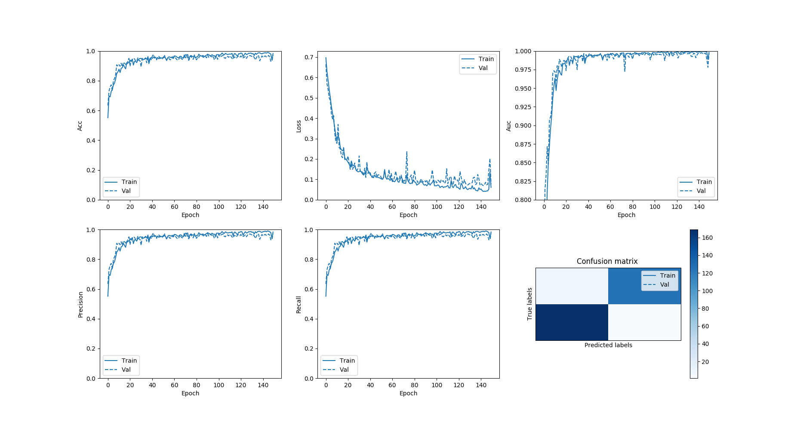
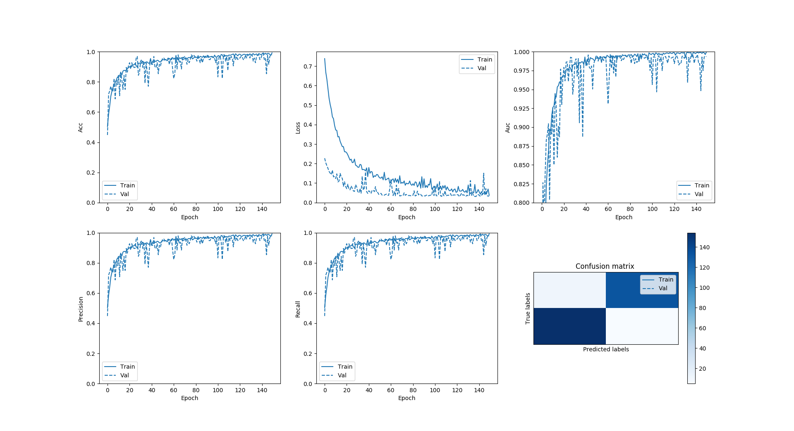

# Peter Moss Leukemia Research Foundation

## ALL-IDB Classifiers

### ALL Papers Evaluation

&nbsp;

# Paper 1 Evaluation (Augmentation)

Here we will train the network we created in [part 1](https://github.com/LeukemiaResearchFoundation/ALL-IDB-Classifiers/blob/master/Python/Tensorflow/2-0/Classification/ALL-Papers/Evaluations/Paper-1.md "part 1"), using the augmented dataset proposed in the [Leukemia Blood Cell Image Classification Using Convolutional Neural Network](http://www.ijcte.org/vol10/1198-H0012.pdf "Leukemia Blood Cell Image Classification Using Convolutional Neural Network") paper by T. T. P. Thanh, Caleb Vununu, Sukhrob Atoev, Suk-Hwan Lee, and Ki-Ryong Kwon.

In this paper the others mention that they were unable to get good results using the network from paper 1 with the augmented dataset from paper 2.

"In the preliminary version of this work that has been published in the 6th International Conference on Advanced Information Technologies and Applications (ICAITA 2017) [9], the authors have also adopted the convolutional neural network but with a slightly shallow architecture compared to the one proposed here and a really small number of data. In the current research, we present a deeper architecture trained on a significantly augmented dataset. Details about data
augmentation are discussed in the next section."

"Our experiments were conducted on Matlab with 1188 images, 70% (831 images) of them for training and the remaining 30% (357 images) for testing our model. The slightly narrow architecture used in [9] dramatically failed to reach an appropriate accuracy when applied to this augmented dataset. Therefore, we have presented here a deeper CNN architecture and changed the size of the input volume in order to improve the accuracy rate of the recognition of leukemia (our proposed CNN model achieved 96.6%)."

For the first part of this evaluation we will use the existing architecture, with a few tweaks to  the configuration and using an augmented version of the dataset. This evaluation will also allow us to determine if the issue with Accuracy, Precision and Recall being equal is related to the size of the dataset or not.

If you have not already read part 1 you can do so [here](https://github.com/LeukemiaResearchFoundation/ALL-IDB-Classifiers/blob/master/Python/Tensorflow/2-0/Classification/ALL-Papers/Evaluations/Paper-1.md "here"). You can continue where you left off, or start from this point.

&nbsp;

## ALL-IDB

You need to be granted access to use the Acute Lymphoblastic Leukemia Image Database for Image Processing dataset. You can find the application form and information about getting access to the dataset on [this page](https://homes.di.unimi.it/scotti/all/#download) as well as information on how to contribute back to the project [here](https://homes.di.unimi.it/scotti/all/results.php). If you are not able to obtain a copy of the dataset please feel free to try this tutorial on your own dataset, we would be very happy to find additional AML & ALL datasets.

### ALL_IDB1 

In this paper, [ALL-IDB1](https://homes.di.unimi.it/scotti/all/#datasets) is used, one of the datsets from the Acute Lymphoblastic Leukemia Image Database for Image Processing dataset. In this evaluation we will also use ALL_IDB1, but an augmented version.

&nbsp;

## Acute Leukemia Classification Using Convolution Neural Network In Clinical Decision Support System


_Fig 1. Proposed architecture ([Source](https://airccj.org/CSCP/vol7/csit77505.pdf "Source"))_

In [Acute Leukemia Classification Using Convolution Neural Network In Clinical Decision Support System](https://airccj.org/CSCP/vol7/csit77505.pdf "Acute Leukemia Classification Using Convolution Neural Network In Clinical Decision Support System"), the authors propose a simple 5 layer Convolutional Neural Network. Code and tutorial for replicating this network exactly can be found 

### Proposed Training / Validation Sets

In the paper the authors use an augmented version of the **ALL_IDB1** dataset. The paper proposes the following training and validation sets, where **Normal cell** refers to ALL negative examples and **Abnormal cell** refers to ALL positive examples.

|               | Training Set | Test Set |
| ------------- | ------------ | -------- |
| Normal cell   |              | 162      |
| Abnormal cell |              | 195      |
| **Total**     | **831**      | **357**  |

In the paper the authors don't specify what made up the rest of their 1188 images, I took the initiative that they used more than 1 rotated copy per image, using 4 rotated copies of each image I was able to create a dataset of 1188 images, but the sizes are slightly different.

```
2019-12-30 06:42:56,441 - Data - INFO - All data: 108
2019-12-30 06:42:56,441 - Data - INFO - Positive data: 49
2019-12-30 06:42:56,441 - Data - INFO - Negative data: 59
2019-12-30 06:43:03,766 - Data - INFO - Augmented data: (1188, 100, 100, 3)
2019-12-30 06:43:03,766 - Data - INFO - All Labels: (1188, 2)
2019-12-30 06:43:03,875 - Data - INFO - Training data: (885, 100, 100, 3)
2019-12-30 06:43:03,875 - Data - INFO - Training labels: (885, 2)
2019-12-30 06:43:03,875 - Data - INFO - Validation data: (303, 100, 100, 3)
2019-12-30 06:43:03,876 - Data - INFO - Validation labels: (303, 2)
```

### Architecture

We will use the same Convolutional Neural Network,  as shown in Fig 1, with exception to the input sizes. The architecture consists of the following 5 layers:

- Conv layer (100x100x30)
- Conv layer (100x100x30)
- Max-Pooling layer (50x50x30)
- Fully Connected layer (2 neurons)
- Softmax layer (Output 2)

&nbsp;

## Hardware

In this evaluation I used 2 machines, a Mac 2,8 GHz Intel Core i5 and an Ubuntu machine with an NVIDIA GTX 1050 ti to compare results.

&nbsp; 

## Clone the repository

First of all you should clone the [ALL-IDB Classifiers](https://github.com/LeukemiaResearchFoundation/ALL-IDB-Classifiers "ALL-IDB Classifiers") repository from the [Peter Moss Leukemia Research Foundation](https://github.com/LeukemiaResearchFoundation "Peter Moss Leukemia Research Foundation") Github Organization. 

To do this, make sure you have Git installed, navigate to the location you want to clone the repository to on your device using terminal/commandline, and then use the following command:

```
  $ git clone https://github.com/LeukemiaResearchFoundation/ALL-IDB-Classifiers.git
```

Once you have used the command above you will see a directory called **ALL-IDB-Classifiers** in the location you chose to clone to. In terminal, navigate to the **ALL-IDB-Classifiers/Python/Tensorflow/2-0/Classification/ALL-Papers/** directory, this is your project root directory.

&nbsp;

## Move the dataset

Now you need to move your ALL-IDB1 dataset to the **ALL-IDB18** directopry in the **Model/Data** directory.

&nbsp;

## Configuration

[config.json](https://github.com/LeukemiaResearchFoundation/ALL-IDB-Classifiers/blob/master/Python/Tensorflow/2-0/Classification/ALL-Papers/Model/config.json "config.json")  holds the configuration for all of the networks that make up  the ALL Papers project. 

```
{
    "model_1": {
        "data": {
            "dim": 50,
            "dim_augmentation": 100,
            "file_type": ".jpg",
            "rotations_augmentation": 3,
            "seed_adam": 32,
            "seed_adam_augmentation": 64,
            "seed_rmsprop": 3,
            "seed_rmsprop_augmentation": 6,
            "split": 0.255,
            "split_augmentation": 0.3,
            "train_dir": "Model/Data/ALL-IDB-1"
        },
        "train": {
            "batch": 80,
            "batch_augmentation": 100,
            "decay_adam": 1e-6,
            "decay_rmsprop": 1e-6,
            "epochs": 150,
            "epochs_augmentation": 150,
            "learning_rate_adam": 1e-4,
            "learning_rate_rmsprop": 1e-4,
            "val_steps": 10,
            "val_steps_augmentation": 3
        }
    }
}
```

&nbsp;

## Metrics

We can use metrics to measure the effectiveness of our model. In this network we will use the following metrics:

```
tf.keras.metrics.BinaryAccuracy(name='accuracy'),
tf.keras.metrics.Precision(name='precision'),
tf.keras.metrics.Recall(name='recall'),
tf.keras.metrics.AUC(name='auc'),
tf.keras.metrics.TruePositives(name='tp'),
tf.keras.metrics.FalsePositives(name='fp'),
tf.keras.metrics.TrueNegatives(name='tn'),
tf.keras.metrics.FalseNegatives(name='fn') 
```

These metrics will be displayed and plotted once our model is trained.

&nbsp;

## Model Summary

Our network matches the architecture proposed in the paper exactly, with exception to the optimizer and loss function as this info was not provided in the paper.

```
Model: "AllCnn"
_________________________________________________________________
Layer (type)                 Output Shape              Param #   
=================================================================
zero_padding2d (ZeroPadding2 (None, 104, 104, 3)       0         
_________________________________________________________________
conv2d (Conv2D)              (None, 100, 100, 30)      2280      
_________________________________________________________________
zero_padding2d_1 (ZeroPaddin (None, 104, 104, 30)      0         
_________________________________________________________________
conv2d_1 (Conv2D)            (None, 100, 100, 30)      22530     
_________________________________________________________________
max_pooling2d (MaxPooling2D) (None, 50, 50, 30)        0         
_________________________________________________________________
flatten (Flatten)            (None, 75000)             0         
_________________________________________________________________
dense (Dense)                (None, 2)                 150002    
_________________________________________________________________
activation (Activation)      (None, 2)                 0         
=================================================================
Total params: 174,812
Trainable params: 174,812
Non-trainable params: 0
_________________________________________________________________
```

&nbsp;

## Training the model

Now you are ready to train your model. In my evaluation I trained on both an Mac 2,8 GHz Intel Core i5, and an Ubuntu machine with an NVIDIA GTX 1050 ti. The results below will show both the Mac and the Ubuntu machine. 

### Ubuntu/GTX 1050 ti

#### Adam Optimizer



_Fig 2. Ubuntu/GTX 1050 ti Adam Optimizer Results_

First we will test using data augmentation with the Adam optimizer and configuration on our Ubuntu/GTX 1050 ti machine. Make sure you are in the project root and execute the following command:

```
python3 AllCnn.py Adam 1 True
```

The above command launches the AllCnn.py program telling it to use the Adam optimizer, to use the model from paper 1, and to augment the data. This will recreate the network architecture proposed in paper 1 and data augmentation proposed in paper 2. First the training and validation data is prepared, then the network is created, compiled, trained and evaluated.

Using the Adam Optimizer on the Ubuntu/GTX 1050 ti did not give stable results across runs. In my testing the results would range from 0.97029704 - 0.980198.

```
2019-12-30 07:33:14,758 - Model - INFO - Metrics: loss 0.07603059777922362
2019-12-30 07:33:14,758 - Model - INFO - Metrics: acc 0.97359735
2019-12-30 07:33:14,758 - Model - INFO - Metrics: precision 0.97359735
2019-12-30 07:33:14,758 - Model - INFO - Metrics: recall 0.97359735
2019-12-30 07:33:14,759 - Model - INFO - Metrics: auc 0.9974295
2019-12-30 07:33:14,759 - Model - INFO - Metrics: tp 295.0
2019-12-30 07:33:14,759 - Model - INFO - Metrics: fp 8.0
2019-12-30 07:33:14,759 - Model - INFO - Metrics: tn 295.0
2019-12-30 07:33:14,759 - Model - INFO - Metrics: fn 8.0
```

In these results, our model has achieved 0.97359735 accuracy (97%) using the Adam optimizer and configuration. In paper 1 the authors achieved 96.43% accuracy, and in paper 2 96.6%.

| Figures of merit     | Value | Percentage |
| -------------------- | ----- | ---------- |
| True Positives       | 126   | 41.58%     |
| False Positives      | 1     | 0.33%         |
| True Negatives       | 169    | 55.78%     |
| False Negatives      | 7     | 1.65%      |
| Misclassification    | 8     | 2.64%      |
| Sensitivity / Recall | 0.974 | 97%        |
| Specificity          | 0.994    | 99%       |

#### RMSprop Optimizer


_Fig 3. Ubuntu/GTX 1050 ti RMSprop Optimizer Results_

Next we will test using data augmentation with the RMSprop optimizer and configuration on our Ubuntu/GTX 1050 ti machine. Make sure you are in the project root and execute the following command:

```
python3 AllCnn.py RMSprop 1 True
```

Using the RMSprop Optimizer on Ubuntu/GTX 1050 ti did not give stable results across runs. In my testing the results would range from  0.9339934 - 0.95049506.

```
2019-12-30 07:18:14,308 - Model - INFO - Metrics: loss 0.18860786661456522
2019-12-30 07:18:14,308 - Model - INFO - Metrics: acc 0.95049506
2019-12-30 07:18:14,309 - Model - INFO - Metrics: precision 0.95049506
2019-12-30 07:18:14,309 - Model - INFO - Metrics: recall 0.95049506
2019-12-30 07:18:14,309 - Model - INFO - Metrics: auc 0.98166853
2019-12-30 07:18:14,309 - Model - INFO - Metrics: tp 288.0
2019-12-30 07:18:14,309 - Model - INFO - Metrics: fp 15.0
2019-12-30 07:18:14,309 - Model - INFO - Metrics: tn 288.0
2019-12-30 07:18:14,309 - Model - INFO - Metrics: fn 15.0
```

| Figures of merit     | Value | Percentage |
| -------------------- | ----- | ---------- |
| True Positives       | 136    | 44.88%     |
| False Positives      | 3     | 0.99%         |
| True Negatives       | 152    | 50.17%     |
| False Negatives      | 12     | 3.96%      |
| Misclassification    | 15     | 4.95%      |
| Sensitivity / Recall | 0.95 | 95%        |
| Specificity          | 0.98     | 98%       |

### Mac 2,8 GHz Intel Core i5

#### Adam Optimizer


_Fig 4. Mac 2,8 GHz Intel Core i5 Adam Optimizer Results_

Using the Adam Optimizer on the Mac 2,8 GHz Intel Core i5 gave stable results across runs. 

```
2019-12-30 19:32:47,132 - Model - INFO - Metrics: loss 0.1512321712750413
2019-12-30 19:32:47,132 - Model - INFO - Metrics: acc 0.9537954
2019-12-30 19:32:47,132 - Model - INFO - Metrics: precision 0.9537954
2019-12-30 19:32:47,133 - Model - INFO - Metrics: recall 0.9537954
2019-12-30 19:32:47,133 - Model - INFO - Metrics: auc 0.98542076
2019-12-30 19:32:47,133 - Model - INFO - Metrics: tp 289.0
2019-12-30 19:32:47,133 - Model - INFO - Metrics: fp 14.0
2019-12-30 19:32:47,133 - Model - INFO - Metrics: tn 289.0
2019-12-30 19:32:47,133 - Model - INFO - Metrics: fn 14.0
```

In these results our model has achieved 0.9537954 accuracy (95%) using data augmentation with the Adam optimizer and configuration on Mac. In paper 1 the authors achieved 96.43% accuracy, and in paper 2 96.6%.

| Figures of merit     | Value | Percentage |
| -------------------- | ----- | ---------- |
| True Positives       | 141    | 46.53%    |
| False Positives      | 9     | 2.97%      |
| True Negatives       | 148    | 48.84%     |
| False Negatives      | 5     | 1.65%      |
| Misclassification    | 14     | 4.62%      |
| Sensitivity / Recall | 0.943 | 94%        |
| Specificity          | 0.923 | 92.3%      |

#### RMSprop Optimizer



_Fig 5. Mac 2,8 GHz Intel Core i5 RMSprop Optimizer Results_

Using the RMSprop Optimizer on the Mac 2,8 GHz Intel Core i5 gave stable results across runs.

```
2019-12-30 20:38:46,820 - Model - INFO - Metrics: loss 0.20646910087847867
2019-12-30 20:38:46,820 - Model - INFO - Metrics: acc 0.9471947
2019-12-30 20:38:46,820 - Model - INFO - Metrics: precision 0.9471947
2019-12-30 20:38:46,820 - Model - INFO - Metrics: recall 0.9471947
2019-12-30 20:38:46,821 - Model - INFO - Metrics: auc 0.98076445
2019-12-30 20:38:46,821 - Model - INFO - Metrics: tp 287.0
2019-12-30 20:38:46,821 - Model - INFO - Metrics: fp 16.0
2019-12-30 20:38:46,821 - Model - INFO - Metrics: tn 287.0
2019-12-30 20:38:46,821 - Model - INFO - Metrics: fn 16.0
```

| Figures of merit     | Value | Percentage |
| -------------------- | ----- | ---------- |
| True Positives       | 133     | 43.89%     |
| False Positives      | 5     | 1.65%         |
| True Negatives       | 154    | 50.82%     |
| False Negatives      | 11     | 3.63%      |
| Misclassification    | 16     | 5.28%      |
| Sensitivity / Recall | 0.947 | 95%        |
| Specificity          | 0.969 | 97% |


&nbsp;

## Observations

The first observation that is immediately obvious is the fact that accuracy, precision and recall are still all equal. Although we have tested with more data, it is still possible that we need more, or it could be an issue with the code. The final observation is that when using augmentation, we are not able to reproduce results across runs consistently, mainly when using GPU. It is known that GPUs can add their additional randomness that maybe causing this. This something that will get investigated in the final part of the evaluation for this paper. 

In the next and final part of this evaluation we will experiment with batch normalization and dropout, as well as other additional layers to see how it helps improve the original model.

Of course, the real test for all of this is to test unseen slides in an application. In the final part of the evaluation we will create an application to test this.

&nbsp;

## Summary

### Adam Optimizer NVIDIA GPU

| Loss          | Accuracy     | Precision     | Recall       | AUC          | TP | TN | FP | FN |
| ------------- | ------------ | ------------- | ------------ | ------------ | -- | -- | -- | -- |
| 0.076 (~0.76%) | 0.974 (~97%) | 0.974 (~97%) | 0.974 (~97%) | 0.9974295 (~100%)| 126 | 1 | 169  | 7  |

### RMSprop Optimizer NVIDIA GPU

| Loss          | Accuracy     | Precision     | Recall       | AUC          | TP | TN | FP | FN |
| ------------- | ------------ | ------------- | ------------ | ------------ | -- | -- | -- | -- |
| 0.188 (~0.19) | 0.950 (~95%) | 0.950 (~95%) | 0.950 (~95%) | 0.981 (~98%)| 136 | 3 | 152  | 12  |

### Adam Optimizer Mac 2,8 GHz Intel Core i5

| Loss          | Accuracy     | Precision     | Recall       | AUC          | TP | TN | FP | FN |
| ------------- | ------------ | ------------- | ------------ | ------------ | -- | -- | -- | -- |
| 0.151 (~0.15%) | 0.954 (~95%) | 0.954 (~95%) | 0.954 (~95%) | 0.985 (~99%)| 141 | 148 | 9  | 5  |

### RMSprop Optimizer Mac 2,8 GHz Intel Core i5

| Loss           | Accuracy        | Precision     | Recall       | AUC          | TP | TN | FP | FN |
| -------------  | ------------    | ------------- | ------------ | ------------ | -- | -- | -- | -- |
| 0.206 (~0.07) | 0.9471 (~94%) | 0.9471 (~94%) |0.9471 (~94%) | 0.980 (~98%)| 133 | 154 | 9  | 11  |

&nbsp;

# Contributing

The Peter Moss Leukemia Research Foundation & Peter Moss Acute Myeloid & Lymphoblastic Leukemia AI Research project encourage and welcome code contributions, bug fixes and enhancements from the Github community.

Please read the [CONTRIBUTING](https://github.com/LeukemiaResearchFoundation/ALL-IDB-Classifiers/blob/master/CONTRIBUTING.md "CONTRIBUTING") document for a full guide to forking our repositories and submitting your pull requests. You will also find information about our code of conduct on this page.

&nbsp;

# Bugs/Issues

We use the [repo issues](https://github.com/LeukemiaResearchFoundation/ALL-IDB-Classifiers/issues "repo issues") to track bugs and general requests related to using this project.

&nbsp;

# Versioning

We use SemVer for versioning. For the versions available, see [Releases](https://github.com/LeukemiaResearchFoundation/ALL-IDB-Classifiers/releases "Releases").

&nbsp;

# Authors

- [Adam Milton-Barker](https://www.leukemiaresearchfoundation.ai/team/adam-milton-barker/profile "Adam Milton-Barker") - Peter Moss Leukemia Research Foundation, Barcelona, Spain

See full list of [contributors](https://github.com/LeukemiaResearchFoundation/ALL-IDB-Classifiers/blob/master/Python/Tensorflow/2-0/Classification/ALL-Papers/contributors "contributors") that were involved in this project.

&nbsp;

# License

This project is licensed under the **MIT License** - see the [LICENSE](https://github.com/LeukemiaResearchFoundation/ALL-IDB-Classifiers/blob/master/LICENSE.md "LICENSE") file for details.