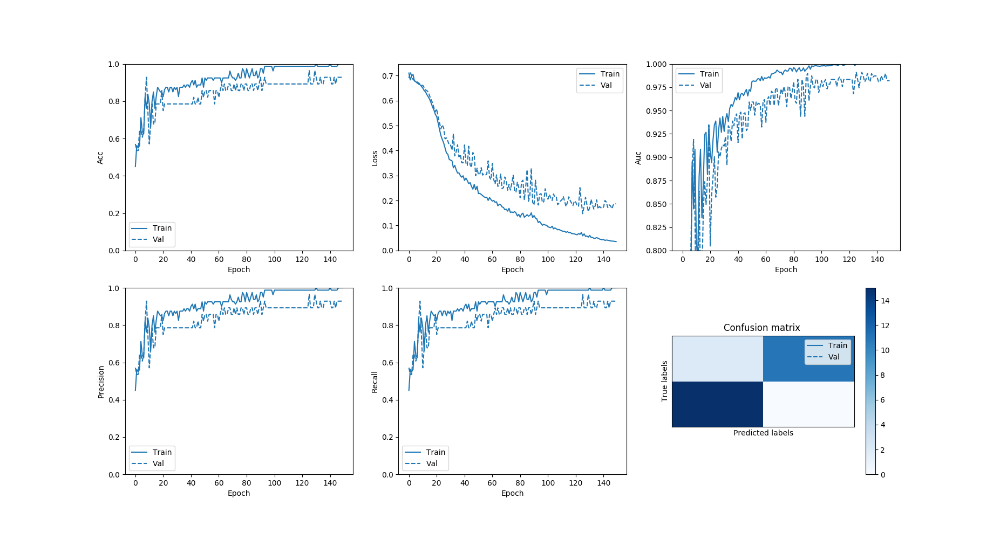
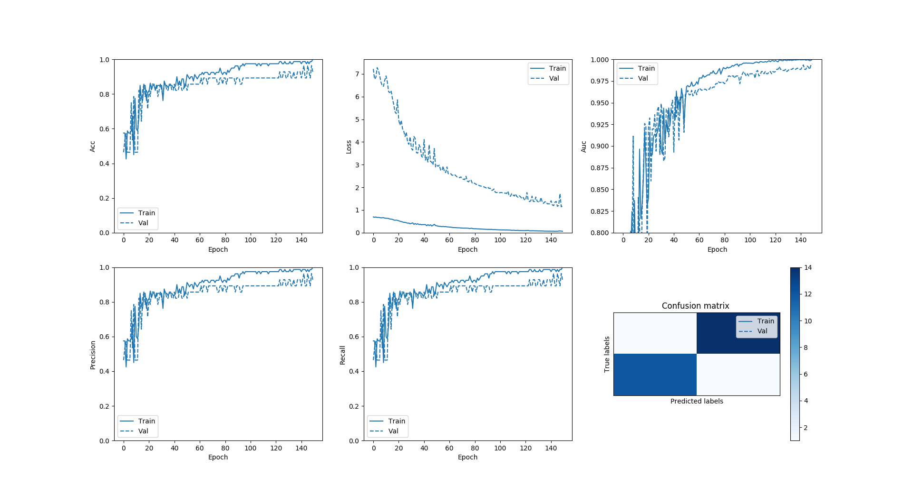
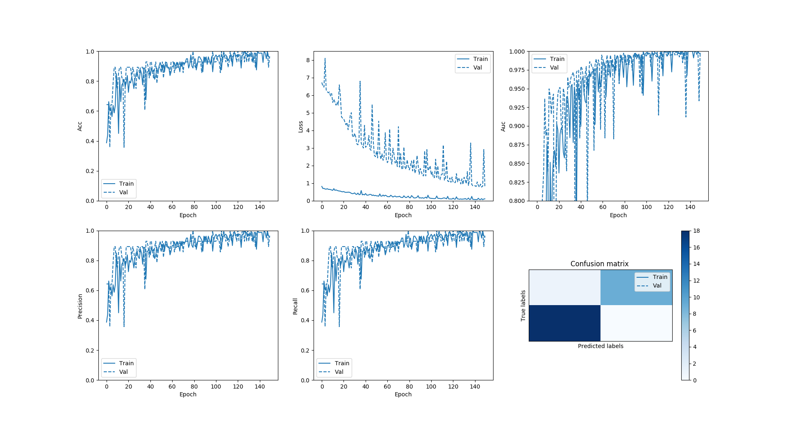

# Peter Moss Leukemia Research Foundation

## ALL-IDB Classifiers

### ALL Papers Evaluation

&nbsp;

# Paper 1 Evaluation

Here we will replicate the network architecture and data split proposed in the [Acute Leukemia Classification Using Convolution Neural Network In Clinical Decision Support System](https://airccj.org/CSCP/vol7/csit77505.pdf "Acute Leukemia Classification Using Convolution Neural Network In Clinical Decision Support System") paper and compare our results. In the paper, the authors do not go into the evaluation of the model, however, in this project we will go deeper into how well the model actually does.

&nbsp;

## ALL-IDB

You need to be granted access to use the Acute Lymphoblastic Leukemia Image Database for Image Processing dataset. You can find the application form and information about getting access to the dataset on [this page](https://homes.di.unimi.it/scotti/all/#download) as well as information on how to contribute back to the project [here](https://homes.di.unimi.it/scotti/all/results.php). If you are not able to obtain a copy of the dataset please feel free to try this tutorial on your own dataset, we would be very happy to find additional AML & ALL datasets.

### ALL_IDB1 

In this paper, [ALL-IDB1](https://homes.di.unimi.it/scotti/all/#datasets) is used, one of the datsets from the Acute Lymphoblastic Leukemia Image Database for Image Processing dataset.

"The ALL_IDB1 version 1.0 can be used both for testing segmentation capability of algorithms, as well as the classification systems and image preprocessing methods. This dataset is composed of 108 images collected during September, 2005. It contains about 39000 blood elements, where the lymphocytes has been labeled by expert oncologists. The images are taken with different magnifications of the microscope ranging from 300 to 500."  

In this project we will also use ALL_IDB1. The dataset is very small, with 108 examples: 49 positive and 59 negative.

&nbsp;

## Acute Leukemia Classification Using Convolution Neural Network In Clinical Decision Support System


_Fig 1. Proposed architecture ([Source](https://airccj.org/CSCP/vol7/csit77505.pdf "Source"))_

In [Acute Leukemia Classification Using Convolution Neural Network In Clinical Decision Support System](https://airccj.org/CSCP/vol7/csit77505.pdf "Acute Leukemia Classification Using Convolution Neural Network In Clinical Decision Support System"), the authors propose a simple 5 layer Convolutional Neural Network. 

> "In this work, we proposed a network contains 4 layers. The first 3 layers for detecting features
> and the other two layers (Fully connected and Softmax) are for classifying the features. The input
> image has the size [50x50x3]. The receptive field (or the filter size) is 5x5. The stride is 1 then we move the filters one pixel at a time. The zero-padding is 2. It will allow us to control the spatial
> size of the output image (we will use it to exactly preserve the spatial size of the input volume so
> the input and output width and height are the same). During the experiment, we found that in our
> case, altering the size of original image during the convolution lead to decrease the accuracy
> about 40%. Thus the output image after convolution layer 1 has the same size with the input
> image."

> "The convolution layer 2 has the same structure with the convolution layer 1. The filter size is 5x5,
> the stride is 1 and the zero-padding is 2. The number of feature maps (the channel or the depth) in
> our case is 30. If the number of feature maps is lower or higher than 30, the accuracy will
> decrease 50%. By experiment, we found the accuracy also decrease 50% if we remove
> Convolution layer 2.""

> "The Max-Pooling layer 25x25 has Filter size is 2 and stride is 2. The fully connected layer has 2
> neural. Finally, we use the Softmax layer for the classification. "

In this paper the authors used the ALL-IDB1 dataset, and did not use data augmentation to increase the training and testing data. However, in paper 2 the authors state that they had poor results using the model from paper 1 with augmented data. In the full evaluation we will use the dataset split proposed in paper 1, the augmented dataset from paper 2, and a custom network. This part of the evaluation wi

There is information about the network not provided by the authors such as learning rate, loss function, optimizer and seed, in this evaluation we will experiment with different values for these settings.

### Proposed Training / Validation Sets

In the paper the authors use the **ALL_IDB1** dataset. The paper proposes the following training and validation sets, where **Normal cell** refers to ALL negative examples and **Abnormal cell** refers to ALL positive examples.

|               | Training Set | Test Set |
| ------------- | ------------ | -------- |
| Normal cell   | 40           | 19       |
| Abnormal cell | 40           | 9        |
| **Total**     | **80**       | **28**   |

### Architecture

We will build a Convolutional Neural Network, as shown in Fig 1, with an architecture consisting of the following 5 layers:

- Conv layer (50x50x30)
- Conv layer (50x50x30)
- Max-Pooling layer (25x25x30)
- Fully Connected layer (2 neurons)
- Softmax layer (Output 2)

&nbsp;

## Hardware

In this evaluation I used 2 machines, a Mac 2,8 GHz Intel Core i5 and an Ubuntu machine with an NVIDIA GTX 1050 ti to compare results. Both machines gave different results, with the Mac being more consistent and accurate. 

&nbsp; 

## Clone the repository

First of all you should clone the [ALL-IDB Classifiers](https://github.com/LeukemiaResearchFoundation/ALL-IDB-Classifiers "ALL-IDB Classifiers") repository from the [Peter Moss Leukemia Research Foundation](https://github.com/LeukemiaResearchFoundation "Peter Moss Leukemia Research Foundation") Github Organization. 

To do this, make sure you have Git installed, navigate to the location you want to clone the repository to on your device using terminal/commandline, and then use the following command:

```
  $ git clone https://github.com/LeukemiaResearchFoundation/ALL-IDB-Classifiers.git
```

Once you have used the command above you will see a directory called **ALL-IDB-Classifiers** in the location you chose to clone to. In terminal, navigate to the **ALL-IDB-Classifiers/Python/Tensorflow/2-0/Classification/ALL-Papers/** directory, this is your project root directory.

&nbsp;

## Move the dataset

Now you need to move your ALL-IDB1 dataset to the **ALL-IDB18** directopry in the **Model/Data** directory.

&nbsp;

## Configuration

[config.json](https://github.com/LeukemiaResearchFoundation/ALL-IDB-Classifiers/blob/master/Python/Tensorflow/2-0/Classification/ALL-Papers/Model/config.json "config.json")  holds the configuration for all of the networks that make up  the ALL Papers project. 

```
{
    "model_1": {
        "data": {
            "dim": 50,
            "dim_augmentation": 100,
            "file_type": ".jpg",
            "rotations_augmentation": 3,
            "seed_adam": 32,
            "seed_adam_augmentation": 64,
            "seed_rmsprop": 3,
            "seed_rmsprop_augmentation": 6,
            "split": 0.255,
            "split_augmentation": 0.3,
            "train_dir": "Model/Data/ALL-IDB-1"
        },
        "train": {
            "batch": 80,
            "batch_augmentation": 100,
            "decay_adam": 1e-6,
            "decay_rmsprop": 1e-6,
            "epochs": 150,
            "epochs_augmentation": 150,
            "learning_rate_adam": 1e-4,
            "learning_rate_rmsprop": 1e-4,
            "val_steps": 10,
            "val_steps_augmentation": 3
        }
    }
}
```

We have the model_1 object containing two objects, data and train. In data we have the configuration related to preparing the training and validation data. We use a seed to make sure our results are reproducible. In train we have the configuration related to training the model.

Notice that the batch amount is 80, this is equal to the amount of data in the training data meaning that the network will see all samples in the dataset before updating the parameters. This was done to try and reduce the spiking effect in our model's metrics. In my case though, removing it actually made the network perform better.  Other things that can help are batch normalization, more data and dropout, but in this project we are going to replicate the work proposed in the paper as close as possible.

In my case, the configuration above was the best out of my testing, but you may find different configurations work better. Feel free to update these settings to your liking, and please let us know of your experiences.

&nbsp;

## Code structure

The code for this project consists of 4 main Python files and a configuration file:

- [config.json](https://github.com/LeukemiaResearchFoundation/ALL-IDB-Classifiers/blob/master/Python/Tensorflow/2-0/Classification/ALL-Papers/Model/config.json "config.json"): The configuration file.
- [AllCnn.py](https://github.com/LeukemiaResearchFoundation/ALL-IDB-Classifiers/blob/master/Python/Tensorflow/2-0/Classification/ALL-Papers/AllCnn.py "AllCnn.py"): A wrapper class.
- [Helpers.py](https://github.com/LeukemiaResearchFoundation/ALL-IDB-Classifiers/blob/master/Python/Tensorflow/2-0/Classification/ALL-Papers/Classes/Helpers.py "Helpers.py"): A helper class.
- [DataP1.py](https://github.com/LeukemiaResearchFoundation/ALL-IDB-Classifiers/blob/master/Python/Tensorflow/2-0/Classification/ALL-Papers/Classes/DataP1.py "DataP1.py"): A data helpers class.
- [ModelP1.py](https://github.com/LeukemiaResearchFoundation/ALL-IDB-Classifiers/blob/master/Python/Tensorflow/2-0/Classification/ALL-Papers/Classes/ModelP1.py "ModelP1.py"): A model helpers class.

&nbsp;

### Classes 

Our functionality for this network can be found mainly in the **Classes** directory. 

|    Class | Description |
| ------------- | ------------ |
| Helpers.py   | [Helpers.py](https://github.com/LeukemiaResearchFoundation/ALL-IDB-Classifiers/blob/master/Python/Tensorflow/2-0/Classification/ALL-Papers/Classes/Helpers.py "Helpers.py") is a helper class for the Tensorflow 2.0 ALL Papers project. The class loads the configuration and logging that the project uses.      |
| DataP1.py | [DataP1.py](https://github.com/LeukemiaResearchFoundation/ALL-IDB-Classifiers/blob/master/Python/Tensorflow/2-0/Classification/ALL-Papers/Classes/DataP1.py "DataP1.py") is a data helper class for the Paper 1 Evaluation. The class provides the functionality for sorting and preparing your training and validation data. the functions in this class reproduce the training and validation data split proposed in the [Acute Leukemia Classification Using Convolution Neural Network In Clinical Decision Support System](https://airccj.org/CSCP/vol7/csit77505.pdf "Acute Leukemia Classification Using Convolution Neural Network In Clinical Decision Support System") paper.       |     |
| ModelP1.py | [ModelP1.py](https://github.com/LeukemiaResearchFoundation/ALL-IDB-Classifiers/blob/master/Python/Tensorflow/2-0/Classification/ALL-Papers/Classes/ModelP1.py "ModelP1.py") is a model helper class for the Paper 1 Evaluation. The class provides the functionality for creating our CNN.       |

&nbsp;

### Functions

 The main functions are briefly explained below:

|    Class | Function |  Description |
| ------------- | ------------ | -------- |
| DataP1.py | data_and_labels_sort() | The data_and_labels_sort() function sorts the data into two Python lists, data[] and labels[]. |
| DataP1.py | data_and_labels_prepare() | The data_and_labels_prepare() function prepares the data and labels for training. |
| DataP1.py | convert_data() | The convert_data() function converts the training data to a numpy array. |
| DataP1.py | encode_labels() | The encode_labels() function One Hot Encodes the labels. |
| DataP1.py | shuffle() | The shuffle() function shuffles the data helping to eliminate bias. |
| DataP1.py | get_split() | The get_split() function splits the prepared data and labels into traiing and validation data. |
| ModelP1.py | build_network() | The build_network() function creates the network architecture proposed in the [Acute Leukemia Classification Using Convolution Neural Network In Clinical Decision Support System](https://airccj.org/CSCP/vol7/csit77505.pdf "Acute Leukemia Classification Using Convolution Neural Network In Clinical Decision Support System") paper. |
| ModelP1.py | compile_and_train() | The compile_and_train() function compiles and trains the model proposed in the [Acute Leukemia Classification Using Convolution Neural Network In Clinical Decision Support System](https://airccj.org/CSCP/vol7/csit77505.pdf "Acute Leukemia Classification Using Convolution Neural Network In Clinical Decision Support System") paper. |
| ModelP1.py | evaluate_model() | The evaluate_model() function evaluates the model, and displays the values for the metrics we specified. |

&nbsp;

## Metrics

We can use metrics to measure the effectiveness of our model. In this network we will use the following metrics:

```
tf.keras.metrics.BinaryAccuracy(name='accuracy'),
tf.keras.metrics.Precision(name='precision'),
tf.keras.metrics.Recall(name='recall'),
tf.keras.metrics.AUC(name='auc'),
tf.keras.metrics.TruePositives(name='tp'),
tf.keras.metrics.FalsePositives(name='fp'),
tf.keras.metrics.TrueNegatives(name='tn'),
tf.keras.metrics.FalseNegatives(name='fn') 
```

These metrics will be displayed and plotted once our model is trained.  A useful tutorial while working on the metrics was the [Classification on imbalanced data](https://www.tensorflow.org/tutorials/structured_data/imbalanced_data) tutorial on Tensorflow's website.

&nbsp;

## Model Summary

Our network matches the architecture proposed in the paper exactly, with exception to the optimizer and loss function as this info was not provided in the paper.

```
Model: "AllCnn"
_________________________________________________________________
Layer (type)                 Output Shape              Param #   
=================================================================
zero_padding2d (ZeroPadding2 (None, 54, 54, 3)         0         
_________________________________________________________________
conv2d (Conv2D)              (None, 50, 50, 30)        2280      
_________________________________________________________________
zero_padding2d_1 (ZeroPaddin (None, 54, 54, 30)        0         
_________________________________________________________________
conv2d_1 (Conv2D)            (None, 50, 50, 30)        22530     
_________________________________________________________________
max_pooling2d (MaxPooling2D) (None, 25, 25, 30)        0         
_________________________________________________________________
flatten (Flatten)            (None, 18750)             0         
_________________________________________________________________
dense (Dense)                (None, 2)                 37502     
_________________________________________________________________
activation (Activation)      (None, 2)                 0         
=================================================================
Total params: 62,312
Trainable params: 62,312
Non-trainable params: 0
```

&nbsp;

## Training the model

Now you are ready to train your model. In my evaluation I trained on both a Mac 2,8 GHz Intel Core i5, and an Ubuntu machine with an NVIDIA GTX 1050 ti. The results below will show both the Mac and the Ubuntu machine. 

### Ubuntu/GTX 1050 ti

#### Adam Optimizer



_Fig 2. Ubuntu/GTX 1050 ti Adam Optimizer Results_

First we will test using the Adam optimizer and configuration. Make sure you are in the project root and execute the following command:

```
python3 AllCnn.py Adam 1 False
```

The above command launches the AllCnn.py program telling it to use the Adam optimizer, to use the model from paper 1, and not to augment the data. This will recreate the network architecture and data split proposed in the paper. First the training and validation data is prepared, then the network is created, compiled, trained and evaluated.

Using the Adam Optimizer on Ubuntu/GTX 1050 ti gave stable results across runs. 

```
2019-12-30 02:56:16,567 - Model - INFO - Metrics: loss 0.1922929584980011
2019-12-30 02:56:16,567 - Model - INFO - Metrics: acc 0.9285714
2019-12-30 02:56:16,567 - Model - INFO - Metrics: precision 0.9285714
2019-12-30 02:56:16,567 - Model - INFO - Metrics: recall 0.9285714
2019-12-30 02:56:16,567 - Model - INFO - Metrics: auc 0.98214287
2019-12-30 02:56:16,567 - Model - INFO - Metrics: tp 26.0
2019-12-30 02:56:16,567 - Model - INFO - Metrics: fp 2.0
2019-12-30 02:56:16,567 - Model - INFO - Metrics: tn 26.0
2019-12-30 02:56:16,567 - Model - INFO - Metrics: fn 2.0
```

In these results, our model has achieved 0.9285714 accuracy (93%) using the Adam optimizer and configuration. In the paper the authors achieved 96.43%.

On the [report the results page](https://homes.di.unimi.it/scotti/all/results.php) on the ALL-IDB website, you can find info about suggested reporting for projects using the ALL-IDB dataset. Once your model has finished training, these stats will be displayed. Please note you have to close the metrics image before the program can complete. 

| Figures of merit     | Value | Percentage |
| -------------------- | ----- | ---------- |
| True Positives       | 11    | 39.30%     |
| False Positives      | 0     | 0%         |
| True Negatives       | 15    | 53.57%     |
| False Negatives      | 2     | 7.14%      |
| Misclassification    | 2     | 7.14%      |
| Sensitivity / Recall | 0.929 | 93%        |
| Specificity          | 1     | 100%       |

#### RMSprop Optimizer


_Fig 3. Ubuntu/GTX 1050 ti RMSprop Optimizer Results_

Next we will test using the RMSprop optimizer and configuration. Make sure you are in the project root and execute the following command:

```
python3 AllCnn.py RMSprop 1 False
```

The above command launches the AllCnn.py program telling it to use the RMSprop optimizer and configuration, to use the model from paper 1, and not to augment the data. This will recreate the network architecture and data split proposed in the paper. First the training and validation data is prepared, then the network is created, compiled, trained and evaluated.

Using the RMSprop Optimizer on Ubuntu/GTX 1050 ti did not give stable results across runs. In my testing the results would range from 0.89285713 - 0.9285714. These results were similar to the results from the Adam optimizer.  

```
2019-12-30 05:01:18,642 - Model - INFO - Metrics: loss 0.15272846817970276
2019-12-30 05:01:18,642 - Model - INFO - Metrics: acc 0.9285714
2019-12-30 05:01:18,642 - Model - INFO - Metrics: precision 0.9285714
2019-12-30 05:01:18,642 - Model - INFO - Metrics: recall 0.9285714
2019-12-30 05:01:18,642 - Model - INFO - Metrics: auc 0.9872449
2019-12-30 05:01:18,642 - Model - INFO - Metrics: tp 26.0
2019-12-30 05:01:18,642 - Model - INFO - Metrics: fp 2.0
2019-12-30 05:01:18,643 - Model - INFO - Metrics: tn 26.0
2019-12-30 05:01:18,643 - Model - INFO - Metrics: fn 2.0
```

| Figures of merit     | Value | Percentage |
| -------------------- | ----- | ---------- |
| True Positives       | 13    | 46.43%     |
| False Positives      | 0     | 0%         |
| True Negatives       | 13    | 36.43%     |
| False Negatives      | 2     | 7.14%      |
| Misclassification    | 2     | 7.14%      |
| Sensitivity / Recall | 0.929 | 93%        |
| Specificity          | 1     | 100%       |

### Mac 2,8 GHz Intel Core i5

#### Adam Optimizer



_Fig 4. Mac 2,8 GHz Intel Core i5 Adam Optimizer Results_

Using the Adam Optimizer on the Mac 2,8 GHz Intel Core i5 gave stable results across runs. 

```
2019-12-30 04:15:24,179 - Model - INFO - Metrics: loss 0.11819522082805634
2019-12-30 04:15:24,180 - Model - INFO - Metrics: acc 0.9285714
2019-12-30 04:15:24,180 - Model - INFO - Metrics: precision 0.9285714
2019-12-30 04:15:24,180 - Model - INFO - Metrics: recall 0.9285714
2019-12-30 04:15:24,180 - Model - INFO - Metrics: auc 0.99489796
2019-12-30 04:15:24,180 - Model - INFO - Metrics: tp 26.0
2019-12-30 04:15:24,180 - Model - INFO - Metrics: fp 2.0
2019-12-30 04:15:24,180 - Model - INFO - Metrics: tn 26.0
2019-12-30 04:15:24,180 - Model - INFO - Metrics: fn 2.0
```
Our model achieved 0.9285714 accuracy (93%) using the Adam optimizer and configuration on Mac 2,8 GHz Intel Core i5. In the paper the authors achieved 96.43% accuracy.

| Figures of merit     | Value | Percentage |
| -------------------- | ----- | ---------- |
| True Positives       | 14    | 50.0%      |
| False Positives      | 1     | 3.57%      |
| True Negatives       | 12    | 42.86%     |
| False Negatives      | 1     | 3.57%      |
| Misclassification    | 2     | 7.14%      |
| Sensitivity / Recall | 0.929 | 93%        |
| Specificity          | 0.923 | 92.3%      |

#### RMSprop Optimizer



_Fig 5. Mac 2,8 GHz Intel Core i5 RMSprop Optimizer Results_

Using the RMSprop Optimizer on the Mac 2,8 GHz Intel Core i5 gave stable results across runs. In my testing, using RMSprop on the Mac i5 matched the accuracy from the network in the paper.

```
2019-12-30 18:28:03,308 - Model - INFO - Metrics: loss 0.07469029724597931
2019-12-30 18:28:03,308 - Model - INFO - Metrics: acc 0.96428573
2019-12-30 18:28:03,308 - Model - INFO - Metrics: precision 0.96428573
2019-12-30 18:28:03,309 - Model - INFO - Metrics: recall 0.96428573
2019-12-30 18:28:03,309 - Model - INFO - Metrics: auc 0.99872446
2019-12-30 18:28:03,309 - Model - INFO - Metrics: tp 27.0
2019-12-30 18:28:03,309 - Model - INFO - Metrics: fp 1.0
2019-12-30 18:28:03,309 - Model - INFO - Metrics: tn 27.0
2019-12-30 18:28:03,309 - Model - INFO - Metrics: fn 1.0
```

| Figures of merit     | Value | Percentage |
| -------------------- | ----- | ---------- |
| True Positives       | 9    |  32.14%      |
| False Positives      | 0     | 0%      |
| True Negatives       | 18    | 64.28%     |
| False Negatives      | 1     | 3.57%      |
| Misclassification    | 1     | 3.57%      |
| Sensitivity / Recall | 0.96428 | 96.43%        |
| Specificity          | 1 | 100%      |


&nbsp;

## Observations

The first observation that is immediately obvious is the fact that accuracy, precision and recall are all equal. This could be due to the small size of the dataset, or it could be a bug in our code. With no information of this sort in the paper, it is hard to know if the authors encountered this issue. We can also notice a spiking effect in the metric plots, this could also be related to the size of the dataset. And the last observation is that using RMSprop on the GPU gives extremely different results. 

In the second part of this evaluation we will augment the data using the methods proposed in Paper 2, [Leukemia Blood Cell Image Classification Using Convolutional Neural Network](http://www.ijcte.org/vol10/1198-H0012.pdf "Leukemia Blood Cell Image Classification Using Convolutional Neural Network") by T. T. P. Thanh, Caleb Vununu, Sukhrob Atoev, Suk-Hwan Lee, and Ki-Ryong Kwon, to see if the increase in data corrects this issue.

&nbsp;

## Summary

### Adam Optimizer NVIDIA 1050 ti GPU (Stable)

| Loss          | Accuracy     | Precision     | Recall       | AUC          | TP | TN | FP | FN |
| ------------- | ------------ | ------------- | ------------ | ------------ | -- | -- | -- | -- |
| 0.192 (~0.19) | 0.927 (~93%) | 0.927 (~0.92%) | 0.927 (~92%) | 0.982 (~98%)| 11 | 15 | 0  | 2  |

### RMSprop Optimizer NVIDIA 1050 ti GPU (Unstable)

| Loss          | Accuracy     | Precision     | Recall       | AUC          | TP | TN | FP | FN |
| ------------- | ------------ | ------------- | ------------ | ------------ | -- | -- | -- | -- |
| 0.152 (~0.15) | 0.927 (~93%) | 0.927 (~0.92%) | 0.927 (~92%) | 0.982 (~98%)| 13 | 13 | 0  | 2  |

### Adam Optimizer Mac 2,8 GHz Intel Core i5 (Stable)

| Loss          | Accuracy     | Precision     | Recall       | AUC          | TP | TN | FP | FN |
| ------------- | ------------ | ------------- | ------------ | ------------ | -- | -- | -- | -- |
| 0.118 (~0.12) | 0.929 (~93%) | 0.929 (~0.93%) | 0.929 (~93%) | 0.994 (~99%)| 14 | 12 | 1  | 1  |

### RMSprop Optimizer Mac 2,8 GHz Intel Core i5 (Stable)

| Loss           | Accuracy        | Precision     | Recall       | AUC          | TP | TN | FP | FN |
| -------------  | ------------    | ------------- | ------------ | ------------ | -- | -- | -- | -- |
| 0.0746 (~0.07) | 0.96428 (~96.43)| 0.96428 (~96.43 | 0.96428 (~96.43 | 0.999 (~100%)| 9 | 18 | 0  | 1  |

&nbsp;

# Contributing

The Peter Moss Leukemia Research Foundation & Peter Moss Acute Myeloid & Lymphoblastic Leukemia AI Research project encourage and welcome code contributions, bug fixes and enhancements from the Github community.

Please read the [CONTRIBUTING](https://github.com/LeukemiaResearchFoundation/ALL-IDB-Classifiers/blob/master/CONTRIBUTING.md "CONTRIBUTING") document for a full guide to forking our repositories and submitting your pull requests. You will also find information about our code of conduct on this page.

&nbsp;

# Bugs/Issues

We use the [repo issues](https://github.com/LeukemiaResearchFoundation/ALL-IDB-Classifiers/issues "repo issues") to track bugs and general requests related to using this project.

&nbsp;

# Versioning

We use SemVer for versioning. For the versions available, see [Releases](https://github.com/LeukemiaResearchFoundation/ALL-IDB-Classifiers/releases "Releases").

&nbsp;

# Authors

- [Adam Milton-Barker](https://www.leukemiaresearchfoundation.ai/team/adam-milton-barker/profile "Adam Milton-Barker") - Peter Moss Leukemia Research Foundation, Barcelona, Spain

See full list of [contributors](https://github.com/LeukemiaResearchFoundation/ALL-IDB-Classifiers/blob/master/Python/Tensorflow/2-0/Classification/ALL-Papers/contributors "contributors") that were involved in this project.

&nbsp;

# License

This project is licensed under the **MIT License** - see the [LICENSE](https://github.com/LeukemiaResearchFoundation/ALL-IDB-Classifiers/blob/master/LICENSE.md "LICENSE") file for details.