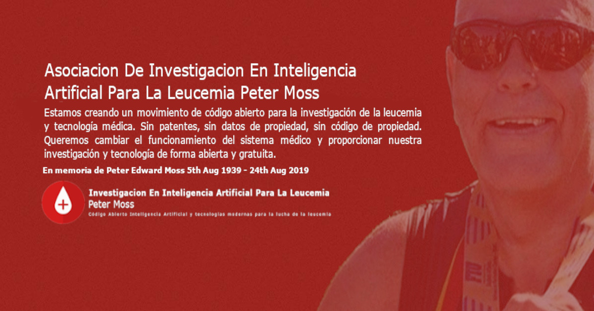

# Asociacion De Investigacion En Inteligencia Artificial Para La Leucemia Peter Moss
## ALL-IDB Classifiers

   

&nbsp;

# Table Of Contents

- [Introduction](#introduction)
- [DISCLAIMER](#disclaimer)
- [ALL-IDB](#all-idb)
- [Evaluations](#evaluations)
- [Contributing](#contributing)
    - [Contributors](#contributors)
    - [Student Contributors](#student-contributors)
- [Versioning](#versioning)
- [License](#license)
- [Bugs/Issues](#bugs-issues) 

&nbsp;

# Introduction
The ALL-IDB Classifers repository hosts a collection of projects using Fabio Scottie's [ALL-IDB (Acute Lymphoblastic Leukemia Image Database for Image Processing)](https://homes.di.unimi.it/scotti/all/) dataset, and replicating networks proposed in some ALL research papers. The repository provides tutorials and codes for creating Convolutional Neural Networks (CNN) for detecting Acute Lymphoblastic Leukemia.

The purpose of the project is to recreate the networks proposed in the papers, and compare results between the different types of networks. Papers used in this evaluation are as follows:

-  **PAPER 1:** [Acute Leukemia Classification Using Convolution Neural Network In Clinical Decision Support System](https://airccj.org/CSCP/vol7/csit77505.pdf "Acute Leukemia Classification Using Convolution Neural Network In Clinical Decision Support System") by Thanh.TTP, Giao N. Pham, Jin-Hyeok Park, Kwang-Seok Moon, Suk-Hwan Lee, and Ki-Ryong Kwon
- **PAPER 2:** [Leukemia Blood Cell Image Classification Using Convolutional Neural Network](http://www.ijcte.org/vol10/1198-H0012.pdf "Leukemia Blood Cell Image Classification Using Convolutional Neural Network") by T. T. P. Thanh, Caleb Vununu, Sukhrob Atoev, Suk-Hwan Lee, and Ki-Ryong Kwon.

&nbsp;

# DISCLAIMER
This project should be used for research purposes only. The purpose of the project is to show the potential of Artificial Intelligence for medical support systems such as diagnosis systems.

Although the classifiers are accurate and show good results both on paper and in real world testing, they are not meant to be an alternative to professional medical diagnosis.

Developers that have contributed to this repository have experience in using Artificial Intelligence for detecting certain types of cancer. They are not a doctors, medical or cancer experts.

Please use these systems responsibly.

&nbsp;

## ALL-IDB

You need to be granted access to use the Acute Lymphoblastic Leukemia Image Database for Image Processing dataset. You can find the application form and information about getting access to the dataset on [this page](https://homes.di.unimi.it/scotti/all/#download) as well as information on how to contribute back to the project [here](https://homes.di.unimi.it/scotti/all/results.php). If you are not able to obtain a copy of the dataset please feel free to try this tutorial on your own dataset, we would be very happy to find additional AML & ALL datasets.

&nbsp;

# Evaluations

This project is made up of evaluations of the stated research papers. These evaluations are listed below.

| Project     | Status | Link |
| -------------------- | ----- | ---------- |
| Paper 1 Evaluation | Complete   | [Paper 1 Evaluation](https://github.com/LeukemiaResearchFoundation/ALL-IDB-Classifiers/blob/master/Python/Tensorflow/2-0/Classification/ALL-Papers/Evaluations/Paper-1.md "Paper 1 Evaluation")     |
| Paper 1 Augmentation Evaluation | Complete   | [Paper 1 Augmentation Evaluation](https://github.com/LeukemiaResearchFoundation/ALL-IDB-Classifiers/blob/master/Python/Tensorflow/2-0/Classification/ALL-Papers/Evaluations/Paper-1-Augmentation.md "Paper 1 Augmentation Evaluation")     |

&nbsp;

# Contributing

Asociacion De Investigacion En Inteligencia Artificial Para La Leucemia Peter Moss encourages and welcomes code contributions, bug fixes and enhancements from the Github.

Please read the [CONTRIBUTING](CONTRIBUTING.md "CONTRIBUTING") document for a full guide to forking our repositories and submitting your pull requests. You will also find information about our code of conduct on this page.

## Contributors

- [Adam Milton-Barker](https://www.leukemiaresearchassociation.ai/team/adam-milton-barker "Adam Milton-Barker") - [Asociacion De Investigation En Inteligencia Artificial Para La Leucemia Peter Moss](https://www.leukemiaresearchassociation.ai "Asociacion De Investigation En Inteligencia Artificial Para La Leucemia Peter Moss") President & Lead Developer, Sabadell, Spain

&nbsp;

# Versioning

We use SemVer for versioning.

&nbsp;

# License

This project is licensed under the **MIT License** - see the [LICENSE](LICENSE "LICENSE") file for details.

&nbsp;

# Bugs/Issues

We use the [repo issues](issues "repo issues") to track bugs and general requests related to using this project.
